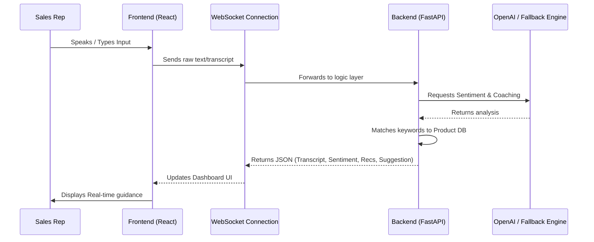

<<<<<<< HEAD
# 🎙️ AI Sales Call Assistant

An intelligent, real-time assistant designed to empower sales representatives during calls. The assistant provides live transcription, sentiment analysis, product recommendations, and instant sales coaching—all powered by a hybrid AI system.

---

## 🎯 Project Objectives
The AI Sales Call Assistant aims to reduce cognitive load on sales reps by:
- **Capturing Conversations**: Real-time transcription using browser-native Web Speech API.
- **Detecting Moods**: Instant sentiment analysis to identify customer satisfaction or frustration.
- **Driving Sales**: Smart keyword extraction to recommend relevant products from the catalog.
- **Expert Coaching**: Providing context-aware advice to handle objections and close deals faster.

---

## 🏗️ Architecture & Technology Stack

The project follows a modern, decoupled architecture using high-performance technologies:

### **Frontend**
- **Framework**: [React](https://reactjs.org/) (via Vite)
- **Styling**: Vanilla CSS with a focus on modern, dark-mode aesthetics.
- **Icons**: [Lucide-React](https://lucide.dev/)
- **Voice-to-Text**: [Web Speech API](https://developer.mozilla.org/en-US/docs/Web/API/Web_Speech_API) (Zero-latency, browser-native).

### **Backend**
- **Framework**: [FastAPI](https://fastapi.tiangolo.com/) (Python)
- **Real-Time Communication**: [WebSockets](https://developer.mozilla.org/en-US/docs/Web/API/WebSockets_API) for full-duplex messaging.
- **AI/LLM**: [OpenAI GPT-3.5](https://openai.com/) for high-level reasoning.
- **Fallback Engine**: Robust Keyword-based matching logic (ensures functionality even without API credits).

---

## 🔄 System Flow



---

## 🚀 API Endpoints

### **Real-time Analysis (WebSocket)**
- **Endpoint**: `ws://localhost:8000/ws/audio/{session_id}`
- **Description**: Handles incoming data and returns real-time analysis packets.
- **Response Format**:
  ```json
  {
    "transcript": "...",
    "sentiment": "Positive/Negative/Neutral",
    "suggestion": "Actionable coaching advice",
    "keywords": ["laptop", "price"],
    "recommendations": [{"id": 1, "name": "...", "description": "..."}]
  }
  ```

### **Post-Call Analytics**
- **Endpoint**: `GET /call/{session_id}/summary`
- **Description**: Generates a professional summary of the entire call session.

---

## 🤝 Contributor

Developed with ❤️ by:

**Mounika K**  
[](https://github.com/kmounikasp)

---

## 🛠️ Setup & Execution

For detailed setup instructions, please refer to the **[RUNBOOK.md](RUNBOOK.md)** file in the root directory.

```bash
# Backend
cd backend
python -m venv venv
.\venv\Scripts\pip install -r requirements.txt
python main.py

# Frontend
cd frontend
npm install
npm run dev
```
=======
# AI_CALL_ASSITANT
>>>>>>> c2d8e56f112a0fd6183aaf7425aa75cc33dd9ea7
